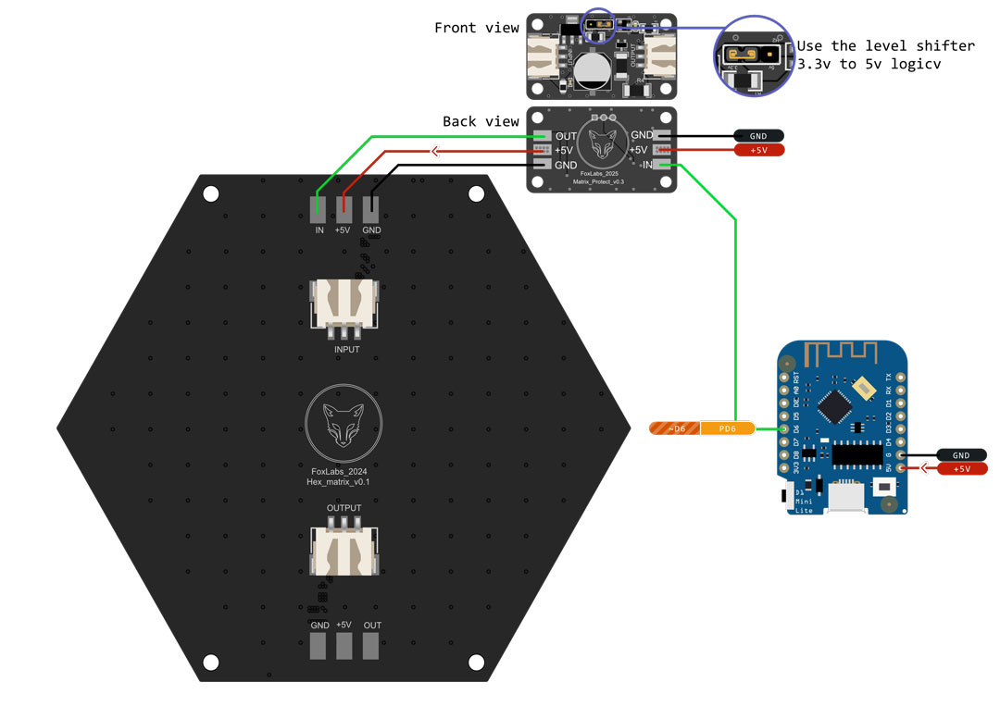
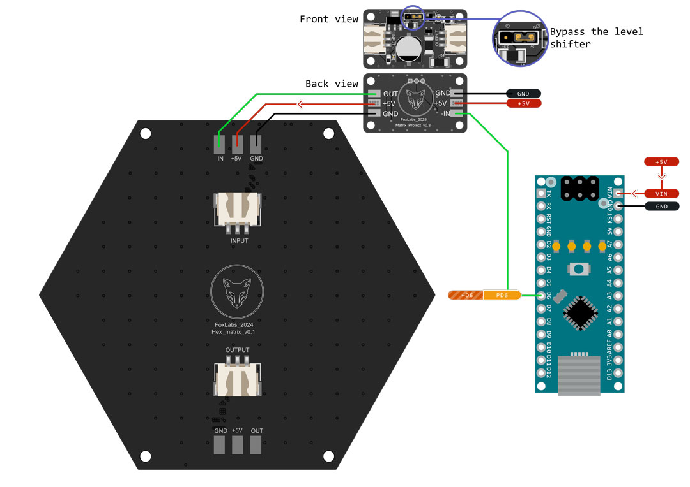

# Protection Module for WS2812B LEDs

Documentation and assets for the WS2812B LED Protection Module, including recommended capacitor, resistor, and optional 3.3V to 5V level shifting.

## 📋 Specifications

- **Size:** 43x25x10mm
- **PCB Thickness:** 1.6mm
- **Mounting Holes:** 4x M3 screw holes evenly spaced around the edge
- **Connector Type:** 3-pin JST HX connector OR soldering pads, for power and data (IN and OUT)

## 🔌 Pin Configuration & Wiring

### IN Connector

| Pin | Function | Description                       |
| --- | -------- | --------------------------------- |
| IN  | Data     | Data input signal from controller |
| 5V  | Power    | 5V DC power supply                |
| GND | Ground   | Ground connection                 |

### OUT Connector

| Pin | Function | Description                     |
| --- | -------- | ------------------------------- |
| OUT | Data     | Data output to LEDs' data input |
| 5V  | Power    | 5V power output for LEDs        |
| GND | Ground   | Ground connection for LEDs      |

### Level Shifter Jumper

The module includes a 2-position jumper for enabling/disabling the 3.3V to 5V level shifter:

| Position | Function | Description                                                                                    |
| -------- | -------- | ---------------------------------------------------------------------------------------------- |
| **EN**   | Enabled  | Activates level shifter — use when connecting to 3.3V logic devices (e.g., STM32, ESP32, etc.) |
| **DIS**  | Disabled | Bypasses level shifter — use when connecting to 5V logic devices (e.g., Arduino, etc.)         |

### Wiring Diagrams

#### ESP8266 Connection

#### Arduino Nano Connection

## 📁 Assets

- **WS2812B Datasheet:** [View Datasheet](https://cdn-shop.adafruit.com/datasheets/WS2812B.pdf)
- **Footprint:** [DXF file](./assets/protection_module_WS2812B.DXF) for the PCB layout and screw holes
- **3D Model:** [STEP file](./assets/protection_module_WS2812B.STEP) for the PCB layout and screw holes

## ⚠️ Important Considerations

- **Power Supply:** Verify that your power supply can support the total current required by the LEDs. The JST HX connectors are rated up to 3A. If you plan to use more (for example, setting the LEDs to full brightness), use the solder pads instead, with appropriately sized AWG wires.
- **Data Integrity:** To prevent signal degradation, especially in long LED chains, keep data lines as short as possible.

---

Built with ❤️ by FoxLabs

This README was generated with AI assistance.
